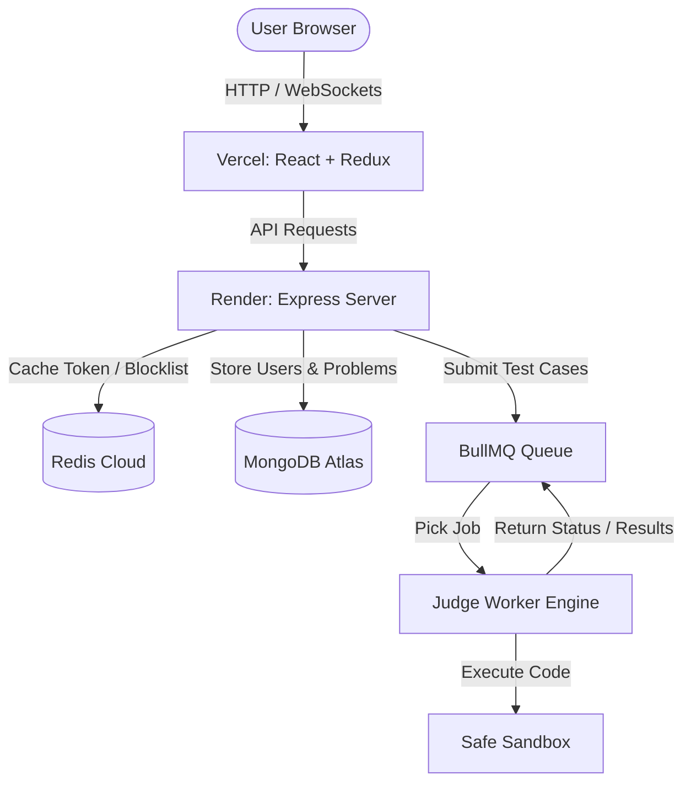

# 💻 Premium Online Coding Platform (LeetCode Clone)

An advanced, high-performance, full-stack online judge platform that allows users to practice programming, run code in real-time against test cases, and receive instant evaluation feedback. Built with a robust modern architecture utilising Node.js, Express, React, Redux, MongoDB, Redis, BullMQ, and a high-speed custom Judge Engine.

---

## 🚀 Deployed Links

* **Frontend App (Vercel):** [https://frontend-peach-ten-81.vercel.app](https://frontend-peach-ten-81.vercel.app)
* **Backend API (Render):** [https://leetcode-backend-ml5e.onrender.com](https://leetcode-backend-ml5e.onrender.com)
* **API Keep-Alive Status:** 🟢 Active (Automatically kept awake 24/7)

---

## 📌 Architecture Diagram

---

## 🌟 Key Features

### 🔐 Authentication & Authorization
* **Secure Auth:** Secure user login and signup flow powered by JWT stored in HttpOnly, secure cookies.
* **Role-Based Access Control (RBAC):** Distinct permissions for `user` and `admin`.
* **Token Blocklisting:** Redis-powered logout system that invalidates tokens instantly.

### 🧩 Problem Management (Admin Only)
* **Admin Dashboard:** Authorised admins can `Create`, `Update`, and `Delete` coding problems.
* **Robust Problem Meta:** Configure Title, Description, Difficulty (Easy, Medium, Hard), Tags (Array, DP, Graphs, LinkedLists), visible test cases (with explanations), and hidden test cases.

### ⚡ Real-Time Code Execution & Automated Evaluation
* **Judge Engine:** Multi-language execution support (JavaScript, C++, Java).
* **Automated Runner:** Run visible test cases or submit solutions for evaluation against hidden test cases.
* **Performance Metrics:** Reports execution runtime (ms) and detailed error reports.

---

## ⚡ Recent Performance Enhancements

We implemented **13 major speed optimizations** to solve the 1-minute loading delay:
1. **Non-Blocking Server Startup:** Server starts listening immediately; DB+Redis connect in the background.
2. **Self-Keep-Alive Engine:** Backend auto-pings every 13 minutes to prevent Render free-tier from sleeping.
3. **Bcrypt Acceleration:** Reduced salt rounds to `8` (~4x faster user operations).
4. **Database Query Projections (`.select().lean()`):** Replaced heavy Mongoose documents with plain objects (~2x faster checks).
5. **Parallelized Initialization:** Combined API ping and auth checks into `Promise.all` (~50% faster startup).

---

## 🛠️ Tech Stack

* **Frontend:** React, Redux Toolkit, TailwindCSS, Axios
* **Backend:** Node.js, Express, Mongoose, Bcrypt, JWT
* **Caching & Queueing:** Redis Cloud, BullMQ
* **Code Sandbox:** Custom compilation & execution sandbox (supports C++, Java, Node.js)
